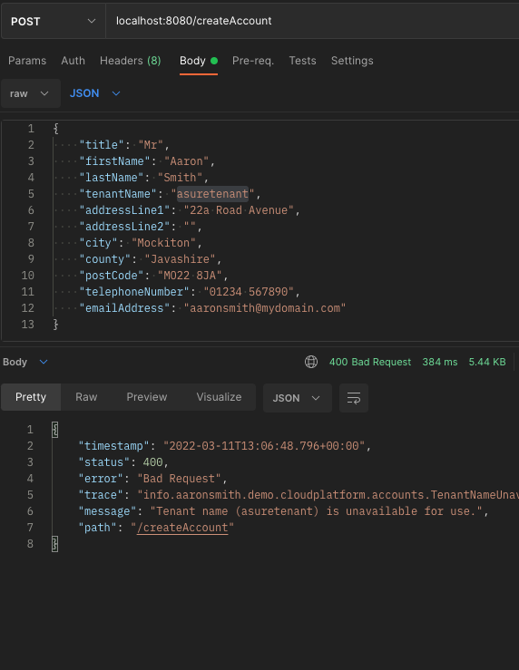
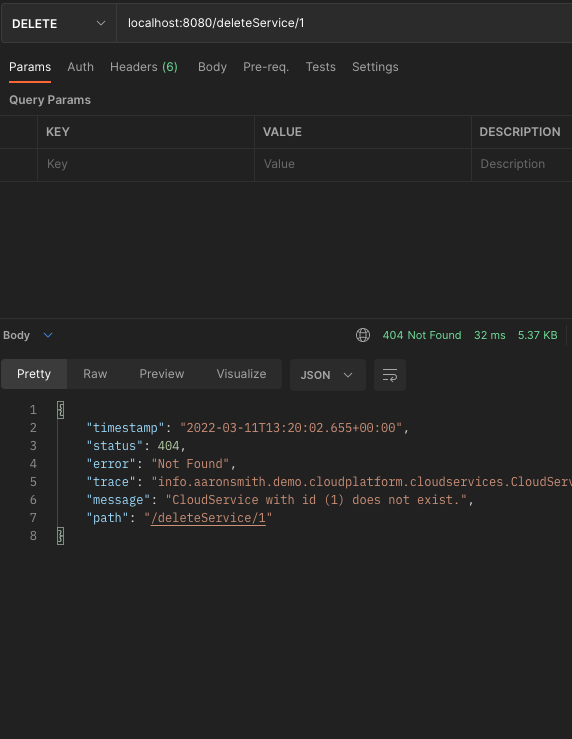

# QA Project Documentation
###### Resources
- [Jira (Roadmap)](https://aaronsmith1203.atlassian.net/jira/software/projects/CP/boards/3/roadmap)

###### Contents
- [[#Introduction|Introduction]]
- [[Risk_Assessment|Risk Assessment]]
- [[#Future|Future]]

### Introduction

This project is to develop a backend for a fictional Cloud Platform. My task is to create a back-end application **REST API** using **Java** and **Spring Boot**, while utilising supporting tools, methodologies, and technologies learnt during the course.

I have decided to use this project as a change to consolidate my understanding of cloud-computing and object-oriented programming by implementing some of the elements demonstrated by existing cloud providers, in particular Microsoft Azure.

- currently provides the customer-layer providing account-management, and subscription-management, where customers can use their accounts to query the services offered, and their costs. And subscribe to services over a period of 1/6/12/24-monthly period, where they save money in the long-term if they commit to a longer renewal period.

*Note - this document contains quotations from the repository [readme](../README.md). The readme is aimed at a more general audience, but some of the content is relevant to this documentation.*

**Cloud Platform** (aka **ASure Cloud**), 


##### Why?
*from [README](../README.md):*
> Your objective with this project is to achieve the following:
>


An application back-end developed using **Java** and **Spring Boot**, and using **MySQL** to build a relational-database for data persistence.

Technologies used:
- **Java** object-oriented programming language
- **Spring Tools**
- **Eclipse** IDE
- **Maven** integrated-build tool. Dependency management
- **JUnit** and **Mockito** for unit and integration testing
- **MySQL** and **MySQL Workbench** for database development
- **Git** and **Github** for code management and source-control
- **Jira** for project management

##### Why are we doing this?

### Project Management
- *see: [Jira Project](https://aaronsmith1203.atlassian.net/jira/software/projects/CP/boards/3/roadmap)*

I have used **Jira** to track my project using Agile/Scrum methods. 

I have organised my work around **epics** and **user stories**, further breaking these requirements down into small tasks that can be implemented. I used *story points* to estimate the relative effort required for tasks, and further evaluated the priority of tasks using *MoSCoW prioritisation*.

I split the 5 days into two sprints of roughly 2.5 days each. While these are quite short it gives me an opportunity to review my progress after the first sprint and readjust for the second sprint. This process is good practice for me, but also gives me a chance to perform a high-level evaluation so that I don't lose perspective.

#### Risk Assessment
- *see: [Risk Assessment](risk-assessment.md)*

### Code
- *see: [Git repository (GitHub)](https://github.com/aaronsmith1203/cloudplatform)*

- uses feature-branch model, where a branch is created for each new feature - tagged with Jira issue number, and then merged into the `development` branch. Releases of the application are created when the features and bug fixes from development are merged into the `main` branch.

##### Packages
Java package `info.aaronsmith.demo.cloudplatform`
- Code related to account-management for the cloud-platform is stored in the `accounts` sub-package.
- Code related to the services offered by the cloud-platform is stored in the `services` sub-package.
- Code related to the RESTful API controller is stored in the `api` sub-package.

### Getting Started with the Application
Application files can be found in the `resources/` directory within the project repository.

#### Installation of database
The application will attempt to connect to a **MySQL** database with the following connection details:
- url: `mysql://localhost:3306/cloudplatform`
- username: `root`
- password: `password`

Install the `cloudplatform` database before attempting to run the application. This can be done by running the `database_init.sql` script located in the `resources/` directory within the repository. 

```bash
$ mysql -u root -p

mysql> source <path-to-repo>/resources/database_init.sql
```

#### Running application
The latest build of the **Java** application `cloudplatform-0.0.1.jar` file is located within the `resources/` directory within the repository.

```bash
$ java -jar <path-to-repo>/resources/cloudplatform-0.0.1.jar
```

#### Testing with Postman
A collection of **Postman** requests have been exported to a file called `Cloud Platform.postman_collection.json`, which is located in the `resources/` directory within the repository. 

This collection of request definitions can be imported into Postman and used against the REST API.

### Application Demo
Current build implements **Account** and **CloudService** entities for the cloud platform.

#### API - Working with Accounts
##### API - Creating an Account





##### API - Reading an Account


##### API - Updating an Account


##### API - Deleting an Account


#### API - Working with Cloud Services
##### API - Creating a Cloud Service


##### API - Reading a Cloud Service


##### API - Updating a Cloud Service


##### API - Deleting a Cloud Service



### Database
- `localhost:3306/cloudplatform`

##### Entity-Relationship Diagram


##### Persistence


### Test Coverage
- `Account` class `hash()` method untested.
- `CloudServive` class `hash()` method untested.
- `CloudPlatformApplication` untested.


### Future
In the future I wish to continue improving my software development skills by implementing a services-layer that will provide the hosted services by using my experience of managing on-premises IT infrastructure.

I hope to make use of server and network equipment that I use in my home lab for learning new technologies to host the services that the cloud platform offers. I anticipate that I will need to find an architecture to work with the APIs provided by technologies such as VMware ESXi to provision virtual machines that are accessible to customers.

I want the platform to be independent of the backend technologies that host the services. I expect I will use an adapter design structure so that the cloud-platform does not need to be modified directly in order to implement a different technology for virtual machines or networking.
